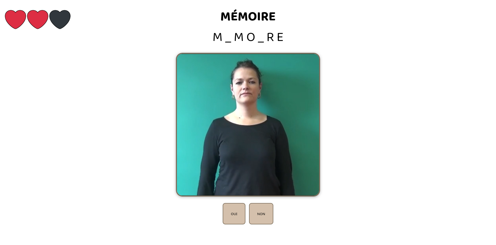

# JEUX SignToKids

# Sommaire
1. [Présentation](#presentation)
2. [Commandes / README](#readme)

## 1 - Présentation 

Dans le cadre d'un stage de première année du master Traitement Automatique des Langues, j'ai été chargée de créer des jeux visant à apprendre la Langue des Signes Française (LSF) et le français écrit à des enfants sourds. Ce travail contribue à l'ensemble des outils et réfléxions mis en oeuvre par l'équipe du projet [SignToKids](https://injs-bordeaux.org/signtokids/) visant à faciliter l'intégration des enfants sourds dans le monde de l'éducation. Le choix des jeux crées ainsi que leurs contenus ont été effectués en collaboration avec des membres du projet. Nous avons de plus choisi les thèmes des animaux, des habitats, de la nourriture et de la culture afin d'encourager l'apprentissage d'un vocabulaire du quotidien. 

Chaque jeu a été codé en python et rendu accessible à l'aide de la framework web Flask. Les langages utilisés sont Python, HTML, CSS et JavaScript. 

### JEU DU QUI-EST-CE

Le jeu du qui-est-ce est composé de trois thématiques : animaux, nourriture et habitats.

Pour chaque thème, un ensemble d'images est renvoyé à l'utilisateur. Des "attributs" vidéos sont ensuite envoyés et permettent d'éliminer les éléments ne répondant pas à cet attribut. Dans le cas des plats, si l'attribut "tomate j'ai" est envoyé, nous pouvons éliminer l'ensemble des plats de contenant pas de tomate. Ces attributs sont uniquement envoyés en LSF. Il ne reste à la fin qu'une seule image correspondant à l'élément choisi par l'ordinateur. Les parties sont crées aléatoirement et permettent ainsi de renouveller l'expérience de jeu de l'utilisateur. 
Vous pouvez trouver une vidéo de démonstration [ici](presentation/qui_est_ce/demo_qui_est_ce.mp4). 

- L'ordinateur choisi un élément à deviner en fonction du thème choisi par l'utilisateur.
- Les images de tous les éléments du thème sont affichés sur la page.
- Un propriété vidéo est envoyée à l'utilisateur.
- L'utilisateur élimine tous les éléments ne répondant pas à la propriété envoyée.
- Une nouvelle propriété est envoyée à l'utilisateur quand tous les éléments éliminables ont été éliminés.
- Cette logique continue jusqu'à ce qu'il ne reste qu'un élément : celui choisi par l'ordinateur. 

Voici quelques captures d'écran du jeu : 

### JEU DU PENDU

Le jeu du pendu suit la logique du jeu tel que vous le connaissez sûrement. Le jeu contient trois modes : un mode image/mot, mot et nombre de lettres. 
1 - Dans le premier mode, un mot est choisi au hasard par l'ordinateur et est affiché sur une page accompagné d'une image pour l'illustrer.
2 - Dans le deuxième, seul le mot est affiché à l'utilisateur.
3 - Dans le troisième, seul le nombre de lettres que contient le mot est affiché à l'utilisateur.

Des lettres de l'alphabet dactylologique sont ensuite envoyées à l'utilisateur (en vidéo) et ce dernier doit dire si elles se trouvent ou non dans le mot choisi.
Le joueur a trois vies et ne doit donc pas faire plus de trois erreurs.
Pour chaque mode de jeu, l'utilisateur a le choix entre trois niveaux de difficultées de mots. Les mots faciles sont des mots assez courts et courants. Les mots moyens sont un peu plus rares et les mots difficiles sont rares, longs ou contenant des ensembles complexes de consonnes/lettres.

Les mots parmi lesquels l'ordinateur choisi sont stockés dans un fichier pouvant être alimenté par les membres du projet et permettant ainsi de renouveller l'expérience de l'utilisateur. Les parties sont également plus ou moins longues de manière aléatoire. Vous trouverez une vidéo de démonstration [ici](presentation/pendu/demo_pendu.mp4). 

Voici quelques captures d'écran du jeu : 

## 2 - Commandes 

### JEU DU PENDU

#### `main_pendu.py`

Ce script permet de lancer une instance de l'application Flask du jeu du pendu et d'ouvir un serveur local. 

**Commande :** 

`python3 main_pendu.py`, plus `ctrl` pour cliquer sur l'adresse après 'Running on http:'. Pour fermer l'instance ouverte par Flask, utilisez la commande `CTRL` + `C`. Si vous ne fermez pas l'instance mais arrêtez l'éxecution du programme, utilisez la commande `lsof` pour obtenir la liste des serveurs ouverts. Fermez ensuite les serveurs python à l'aide de la commande `kill -9 <nom du serveur (en chiffres)>`.

**Prérequis :**

Veillez à avoir le fichier `donnees.py` permettant d'obtenir la liste des mots parmi lesquels l'ordinateur peut choisir. Ce fichier est importé dans `main_pendu.py`.
Veillez de plus à importer l'ensemble des librairies et modules utilisés : **flask (Flask, render_template, session, request), json, random.**
Veillez à avoir un fichier `txt` à la racine du dossier contenant des listes de mots suivant la structure existante (voir `mots.txt`).
Veillez enfin à avoir l'ensemble des fichiers statiques (images et vidéos utilisées) ainsi que les templates `html` du dossier `templates`.

Ces fichiers et programmes peuvent être modifiés afin d'ajouter des mots et photos. Faites cependant attention à respecter une certaine homogéineité au niveau des mots et du nom des fichiers photo correspondants. 

### JEU DU QUI-EST-CE

#### `main_qui.py`

Ce script permet de lancer une instance de l'application Flask du jeu du qui-est-ce et d'ouvir un serveur local. 

**Commande :** 

`python3 main_qui.py`, plus `ctrl` pour cliquer sur l'adresse après 'Running on http:'. Pour fermer l'instance ouverte par Flask, utilisez la commande `CTRL` + `C`. Si vous ne fermez pas l'instance mais arrêtez l'éxecution du programme, utilisez la commande `lsof` pour obtenir la liste des serveurs ouverts. Fermez ensuite les serveurs python à l'aide de la commande `kill -9 <nom du serveur (en chiffres)>`.

**Prérequis :**

Veillez à avoir le fichier `donnees.py` permettant d'obtenir la liste des éléments parmi lesquels l'ordinateur peut choisir et leurs valeurs booléenes pour chaque attribut vidéo. Ce fichier est importé dans `main_qui.py`.
Veillez de plus à importer l'ensemble des librairies et modules utilisés : **flask (Flask, render_template, session, request, jsonify, redirect, url_for), json, random, os.**
Veillez enfin à avoir l'ensemble des fichiers statiques (images et vidéos utilisées) ainsi que les templates `html` du dossier `templates`.

Ces fichiers et programmes peuvent être modifiés afin de créer de nouvelles parties dédiées à des thématiques différentes. Faites cependant attention à respecter une certaine homogéineité au niveau des noms de clés des dictionnaires et du nom des fichiers photo correspondants. 

